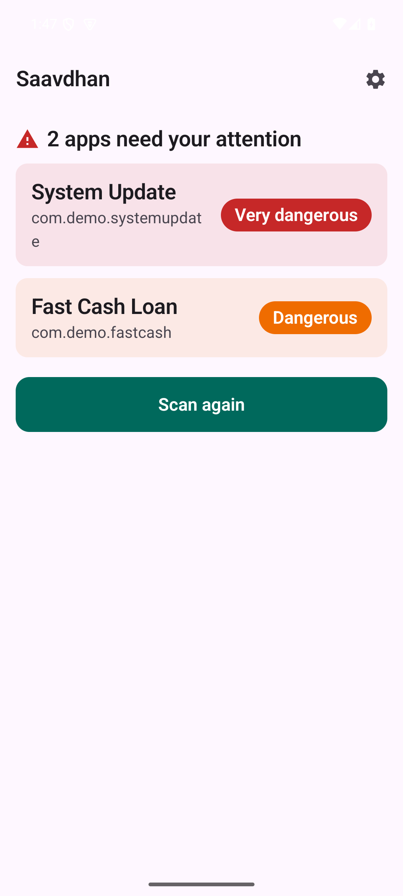
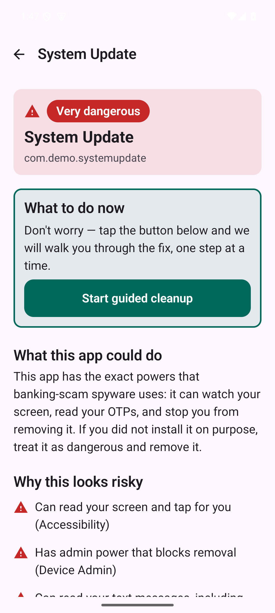
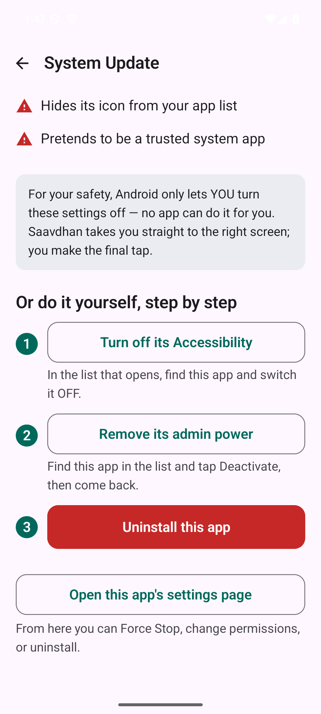

<div align="center">

# 🛡️ Saavdhan (सावधान)

**A free, fully-offline Android app that helps non-technical people find and safely remove scam/spyware apps from their phone — in Hindi or English.**

[](https://github.com/kalpitt/saavdhan/actions/workflows/ci.yml)
[](LICENSE)
[](#)
[](#)
[-success.svg)](#the-promises-that-never-change)

</div>

---

## Why this exists

In India (and increasingly elsewhere), scam APKs spread over WhatsApp disguised as wedding
invitations, courier updates, KYC notices, or electricity bills. Installing one sideloads
banking spyware from the **SpyNote / SpyMax** family, which abuses **Accessibility + Device Admin
+ SMS** access to steal OTPs and drain bank accounts — and actively resists being removed.

Cleaning an infected phone for a non-technical relative today means 30–40 minutes of panicked
digging through Settings. **Saavdhan makes it calm and fast:** it detects the dangerous apps,
explains the risk in plain language, and takes the user one tap to the exact screen where they can
fix it.

> ⚠️ **Disclaimer.** Saavdhan is a *defensive aid*, not a guarantee. It uses behavioural heuristics
> (not a malware database) to flag apps that *look* dangerous; it can produce false alarms and can
> miss brand-new threats. It guides you — it never silently changes or deletes anything. Provided
> **as is**, with no warranty (see [LICENSE](LICENSE)). If money has already been stolen, contact
> your bank and local cyber-crime authorities (in India, call **1930** / cybercrime.gov.in).

## What it looks like

| Detect | Explain | Guide |
|---|---|---|
|  |  |  |

Fully bilingual (हिन्दी / English), chosen on first launch. More in [docs/screenshots](docs/screenshots/README.md).

## The promises that never change

1. **Fully offline.** The app does not hold the `INTERNET` permission, so the operating system
   makes any network call *impossible*. Your data has nowhere to go.
2. **Detective + guide, not enforcer.** Android only lets *you* turn off another app's powers, so
   Saavdhan takes you straight to the right screen and coaches the final tap — it never fakes an
   "auto-fix."
3. **Explainable, not magic.** Every verdict lists its reasons in plain words. No black-box AI.
4. **Calm under panic.** Big buttons, simple language, one clear step at a time.
5. **Honest about limits.** When Android blocks something, the app says so.

## How it works (for the curious)

It reads public, no-root signals about each installed app — whether it holds Accessibility, is a
Device Admin, can read SMS, was sideloaded, hides its icon, or impersonates a system app — and a
small, **deterministic, fully-tested rule engine** turns those into a risk level with reasons.

The full design — architecture, the detection rules and the threats behind them, the OS
constraints, the security/privacy model, and a decision record for every important choice — lives
in **[docs/](docs/README.md)**.

## Build & run

```bash
# Requires Android Studio (bundles the SDK). Then, from the project root:
export JAVA_HOME="/Applications/Android Studio.app/Contents/jbr/Contents/Home"   # macOS
export ANDROID_HOME="$HOME/Library/Android/sdk"

./gradlew testDebugUnitTest   # run the detection-engine tests (fast, no phone needed)
./gradlew assembleDebug       # build the app
```

Or open the folder in **Android Studio** and press ▶ Run. New to Android development? The
beginner-friendly [build guide](docs/08-build-and-run.md) explains every term.

## Project status

**Early release (v0.1.0).** Phase 1 (scanner core) and Phase 2 (guided cleanup) are complete and
tested — the full loop works: bilingual detect → explain → reactive guided cleanup, plus a
WorkManager background watchdog for newly-installed threats. See the [roadmap](docs/10-roadmap.md)
and the [changelog](CHANGELOG.md).

> Tested on the Android emulator. **Help wanted:** real-device testing across phone makers.
> Android's deep-links to system screens differ between makers (Samsung, Xiaomi, Oppo, Vivo…), so
> if a "fix" button lands on the wrong screen on your phone, please [open an issue](../../issues) —
> that feedback is gold.

## Contributing

Contributions are very welcome — especially new detection signals, translations, and real-world
testing across phone makes. Please read **[CONTRIBUTING.md](CONTRIBUTING.md)** first; it covers the
five non-negotiable principles above and how to build/test. Be kind: we follow a
[Code of Conduct](CODE_OF_CONDUCT.md). To report a security concern, see [SECURITY.md](SECURITY.md).

**Using an AI coding assistant?** Point it at **[AGENTS.md](AGENTS.md)** — it's the single,
tool-agnostic brief that orients any agent (rules, build commands, project map). The living
project state and session history live in **[context/](context/README.md)** so work can continue
across chats and tools without losing the thread.

## Tech

Native Android · Kotlin · Jetpack Compose · Material 3 · WorkManager · minSdk 24 / targetSdk 35 ·
no network permission.

## License

[MIT](LICENSE) © 2026 Kalpit Tiwari and the Saavdhan contributors. Use it, fork it, ship it — help
keep people safe.
