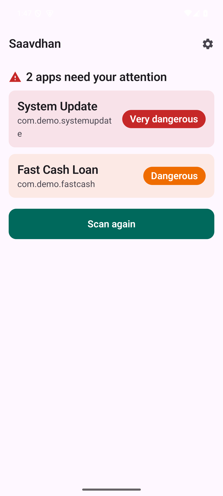
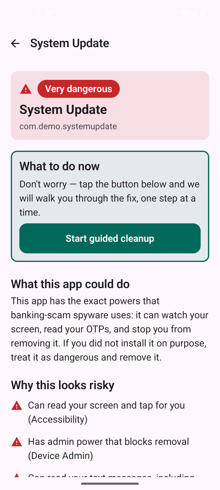
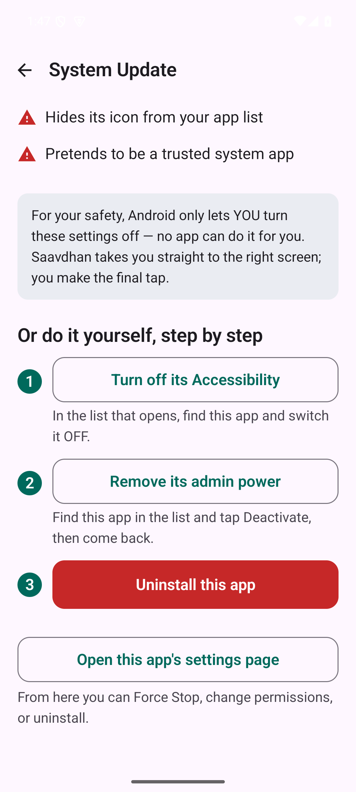
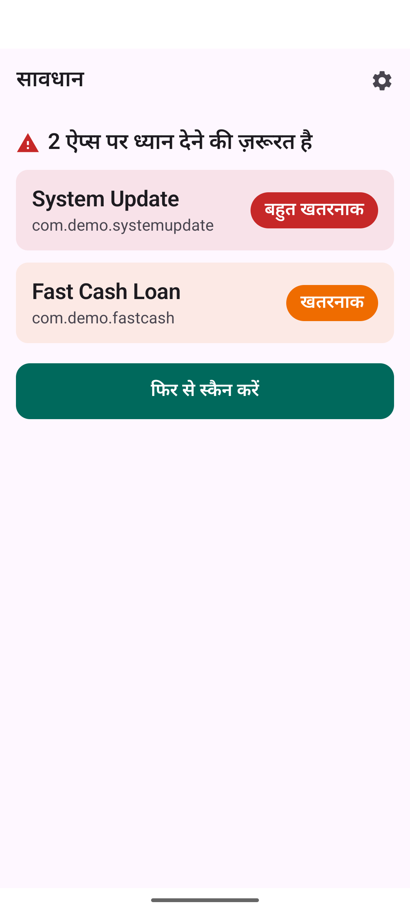
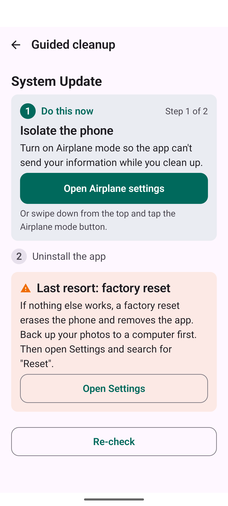
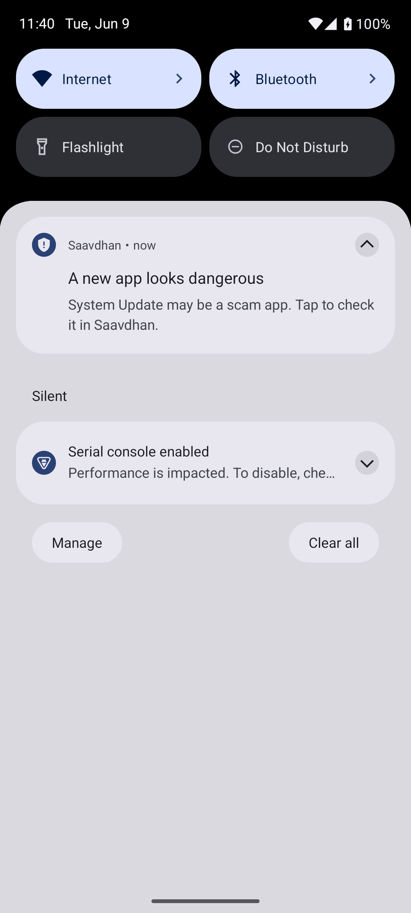

<div align="center">

# Saavdhan (सावधान)

**A free, fully-offline Android app that helps families find and safely remove scam or spyware apps from a phone, in Hindi or English.**

[Download latest APK](https://github.com/kalpitt/saavdhan/releases/latest/download/saavdhan.apk)
·
[Privacy policy](https://kalpitt.github.io/saavdhan/privacy.html)
·
[Open an issue](https://github.com/kalpitt/saavdhan/issues)

[](https://github.com/kalpitt/saavdhan/actions/workflows/ci.yml)
[](LICENSE)
[](#install)
[](#build-from-source)
[-success.svg)](#why-you-can-trust-it)

</div>

---

## What Saavdhan Does

Scam APKs in India often arrive through WhatsApp or Telegram as wedding invitations, courier
updates, KYC notices, e-challans, or electricity-bill files. Once installed, they can abuse powers
like Accessibility, Device Admin, SMS access, notification access, hidden icons, and fake system
names to steal OTPs, spy on the phone, or make removal confusing.

Saavdhan is built for the family member who is already stressed. It scans installed apps, explains
why something looks risky, and opens the exact Android Settings screen where the user can remove
dangerous powers.

It is a detective and guide, not an enforcer. Android deliberately requires the phone owner to make
the final change, so Saavdhan never pretends to silently fix or delete another app.

## See It In Action

| Scan | Explain | Guide |
|---|---|---|
|  |  |  |

| Hindi results | Guided cleanup | Watchdog warning |
|---|---|---|
|  |  |  |

More screenshots are in [docs/screenshots](docs/screenshots/README.md).

## Why You Can Trust It

**Fully offline.** Saavdhan does not request Android's `INTERNET` permission. That means the
operating system blocks the app from making network calls. Your app list and scan results stay on
the phone.

**No account, ads, telemetry, or cloud scoring.** Detection runs on the device using rules shipped
inside the app.

**Explainable verdicts.** Every risk level comes with plain-language reasons. No black-box AI and
no remote malware lookup.

**Honest about Android limits.** Saavdhan guides the user to the right settings screen. It does not
claim to auto-disable powers that Android only lets the user change.

**Open source.** The code, detection rules, architecture notes, and decision records are public in
this repository.

## Install

1. On the Android phone you want to protect, download the latest APK:
   [github.com/kalpitt/saavdhan/releases/latest/download/saavdhan.apk](https://github.com/kalpitt/saavdhan/releases/latest/download/saavdhan.apk)
2. Open the downloaded file. Android may ask you to allow installs from your browser because this
   is a direct download outside the Play Store.
3. Open Saavdhan, choose Hindi or English, and tap **Scan my phone**.

Requirements: Android 7.0 or newer.

## Current Status

**v0.7.0 is released.** It fixes the Uninstall button on Android 9+ phones and shows live
progress in guided cleanup until the dangerous app is confirmed gone. The app includes bilingual
scan results, guided cleanup, a background
watchdog for newly installed threats, offline family-share receipts, OEM-aware Android Settings
deep links, trusted-signature checks, and 13 deterministic detection signals covering common
WhatsApp/Telegram sideload-lure campaigns.

The core unit test suite has 136 tests. The debug build has been tested on the Android emulator.
Real-device testing across phone makers is the highest-value help needed now, especially Samsung,
Xiaomi, Oppo, Vivo, Huawei, Motorola, and OnePlus.

If a fix button opens the wrong Settings page on your phone, please
[open an issue](https://github.com/kalpitt/saavdhan/issues). Android Settings screens differ by
manufacturer, and real-device reports are extremely useful.

## How Detection Works

Saavdhan reads no-root, on-device facts that Android exposes about installed apps, including:

- Whether an app was sideloaded or appears to have come through a messenger
- Accessibility, Device Admin, SMS, notification-listener, and install-package powers
- Hidden launcher icons
- Labels that look like scam lures, such as wedding invite, KYC, bill update, courier, or e-challan
- Attempts to impersonate system, Google, settings, security, or update apps
- Known trusted app signatures, so legitimate apps are not second-guessed

A deterministic, point-based rule engine turns those signals into a risk level and ordered reasons.
The rules are documented in [docs/03-detection-rules.md](docs/03-detection-rules.md).

## Important Disclaimer

Saavdhan is a defensive aid, not a guarantee. It uses behavioural heuristics, not a complete malware
database. It can raise false alarms and can miss brand-new threats. It never silently changes or
deletes anything.

If money has already been stolen in India, contact your bank immediately and report cyber fraud via
**1930** or [cybercrime.gov.in](https://cybercrime.gov.in/).

## Build From Source

```bash
# Requires Android Studio, which bundles the Android SDK and a suitable JDK.
export JAVA_HOME="/Applications/Android Studio.app/Contents/jbr/Contents/Home"
export ANDROID_HOME="$HOME/Library/Android/sdk"

./gradlew testDebugUnitTest
./gradlew assembleDebug
```

Or open the folder in Android Studio and press Run. If you are new to Android development, start
with the beginner-friendly [build guide](docs/08-build-and-run.md).

For a fuller local verification pass:

```bash
./gradlew ktlintCheck testDebugUnitTest assembleDebug :app:lintDebug
```

## Project Map

- [docs/01-vision-and-scope.md](docs/01-vision-and-scope.md): product vision and scope
- [docs/02-architecture.md](docs/02-architecture.md): architecture overview
- [docs/03-detection-rules.md](docs/03-detection-rules.md): risk engine signals and scoring
- [docs/05-security-and-privacy.md](docs/05-security-and-privacy.md): privacy and security model
- [docs/10-roadmap.md](docs/10-roadmap.md): roadmap
- [CHANGELOG.md](CHANGELOG.md): release history

## Contributing

Contributions are welcome, especially:

- Real-device testing reports across Android manufacturers
- High-confidence offline detection signals with low false-positive risk
- Hindi/English copy improvements
- Accessibility fixes
- Documentation and build improvements

Please read [CONTRIBUTING.md](CONTRIBUTING.md), [CODE_OF_CONDUCT.md](CODE_OF_CONDUCT.md), and
[SECURITY.md](SECURITY.md) before opening a pull request.

Using an AI coding assistant? Point it at [AGENTS.md](AGENTS.md). It contains the repository rules,
build commands, architecture boundaries, and the non-negotiable offline promise.

## Tech

Native Android · Kotlin · Jetpack Compose · Material 3 · WorkManager · minSdk 24 / targetSdk 35 ·
no network permission

## License

[MIT](LICENSE) © 2026 Kalpit Tiwari and the Saavdhan contributors.
